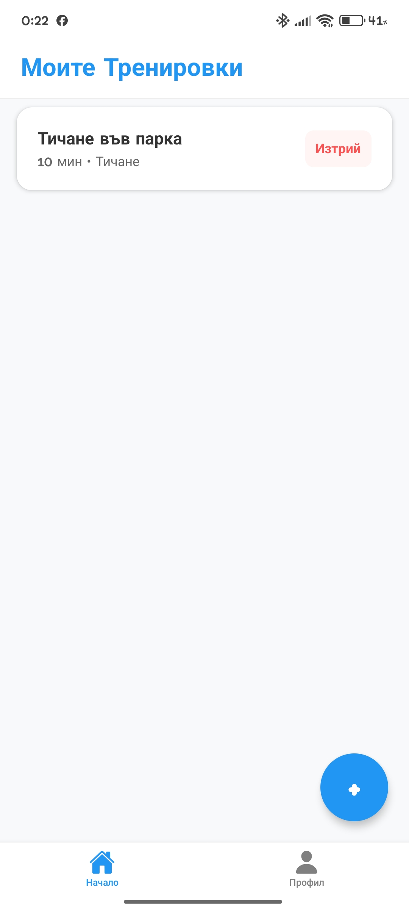
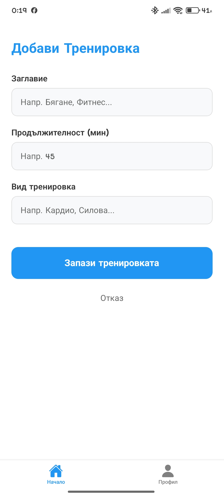
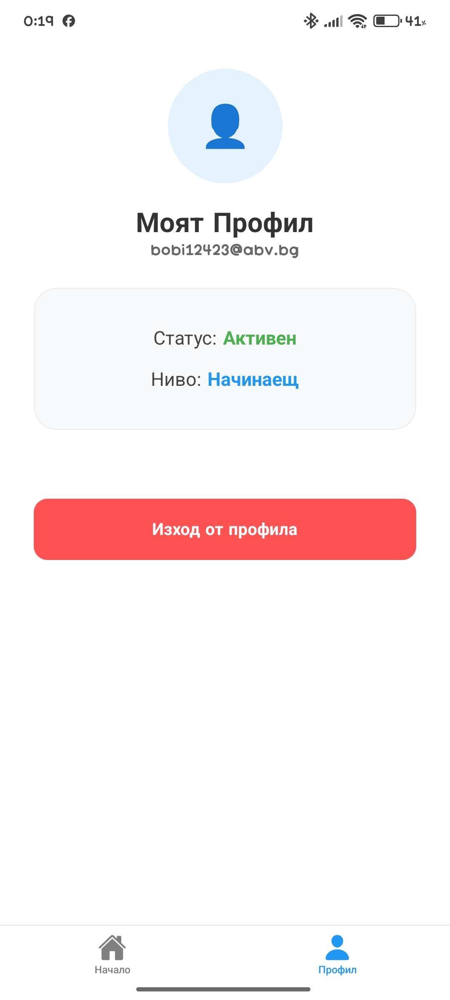

# 🏋️‍♂️ FitTrack App - Mobile Workout Manager
## 🛠 Инструкции за стартиране
1. Инсталирайте зависимостите: `npm install`
2. Стартирайте Expo: `npx expo start`
3. Отворете през Expo Go (Android/iOS) или емулатор.

## ⚙️ Технически стек
- **React Native & Expo**
- **React Navigation** (Stack & Bottom Tab)
- **Context API** за управление на сесиите
- **MockAPI / Firebase** за съхранение на данни
Приложение за управление на фитнес тренировки, изградено с **React Native** и **Expo**.

## 📑 Инструкция за изпита (EXAM INFO)
- **Студент:** [Богдан Богданов]
- **Проект:** FitTrack App
- **Директен линк към APK:** 
https://drive.google.com/file/d/1JDQpn7clzVfGNPJnkLb6rF6827UO5H_5/view?usp=drive_link
---

## 🚀 Функционалности
- **Автентикация:** Сигурен вход и регистрация.
- **Управление на тренировки:** Добавяне, редактиране и изтриване на данни (CRUD).
- **Профил:** Потребителска информация и интеграция с камерата за профилна снимка.
- **API Интеграция:** Използване на REST API (MockAPI) за съхранение на данни.

## 🛠 Технологичен стек
| Технология | Описание |
| :--- | :--- |
| **React Native** | Основна рамка за мобилното приложение |
| **Expo** | Платформа за разработка и лесно билдване |
| **TypeScript** | Строга типизация за по-чист код |
| **React Navigation** | Навигация между екраните (Stack Navigation) |
| **Context API** | Управление на глобалното състояние (Auth) |

## 📸 Скрийншоти

  
  
  

## 📝 Functional Guide (Ръководство)

### Общо описание
FitTrack App е мобилно приложение за управление на фитнес тренировки. Позволява на потребителите да проследяват напредъка си чрез добавяне на упражнения и управление на профил.

### Потребителски поток (User Flow)
1. **Екран за добре дошли/Вход:** Потребителят влиза в акаунта си или създава нов.
2. **Начален екран (Home):** Списък с текущи тренировки, извлечени от API.
3. **Добавяне на тренировка:** Форма с валидация за име и тип на упражнението.
4. **Детайли:** Преглед на специфична информация за избраната тренировка.
5. **Профил:** Управление на лични данни и изход (Logout).

### Валидации
- Валидация на имейл адрес.
- Парола: минимум 6 символа.
- Задължителни полета при добавяне на нова тренировка.
